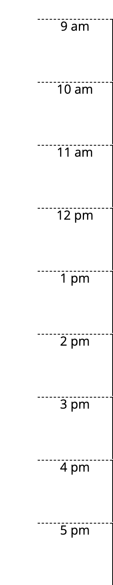
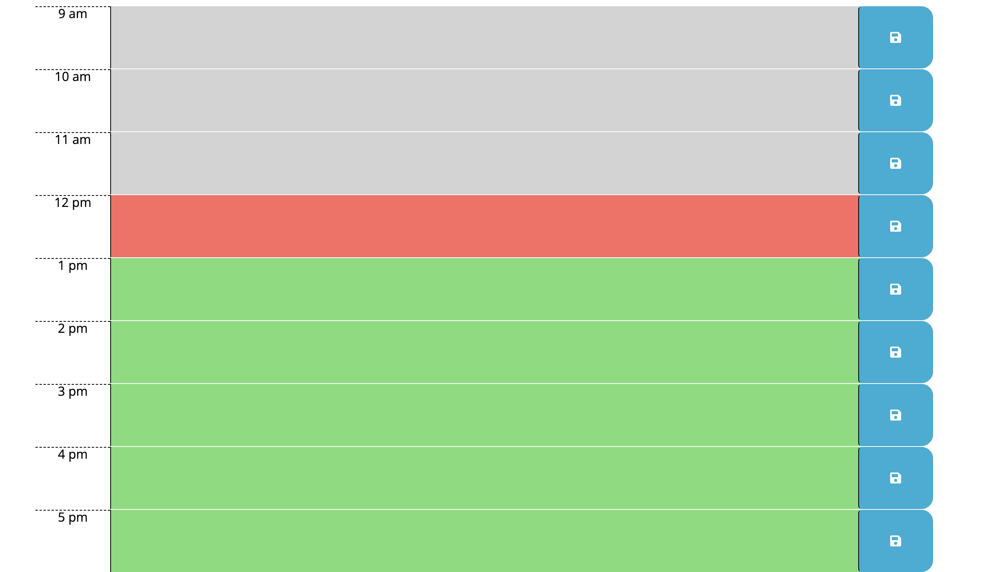
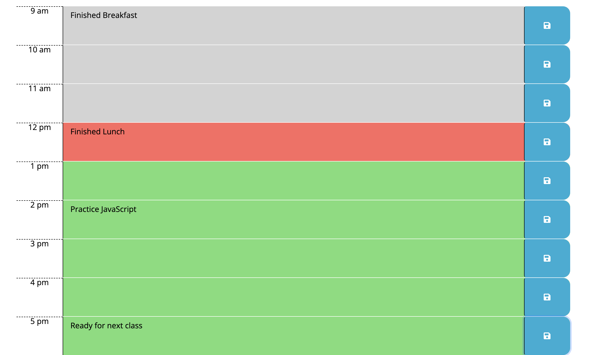
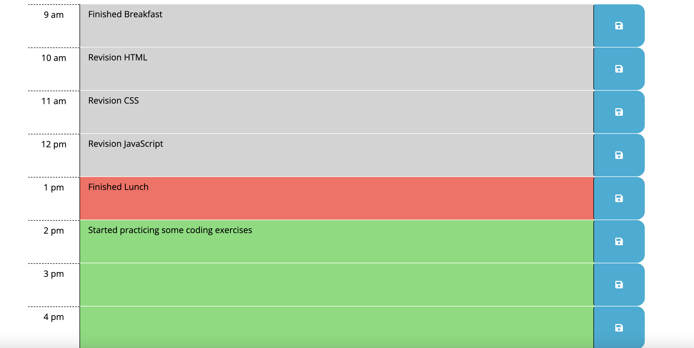
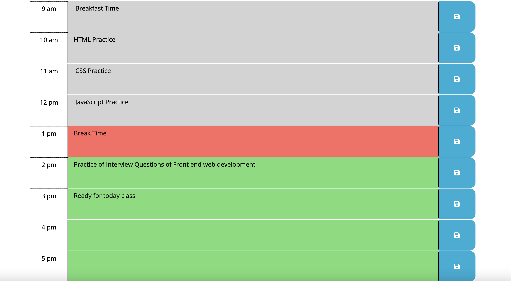
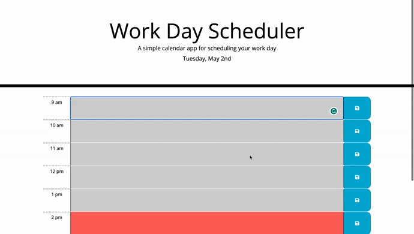

# Third-Party APIs: Daily Planner App
Challenge 7 : In this Challenge, we need to create a simple calendar application that allows a user to save events for each hour of the day by modifying starter code.

# Project Requirements:
  The app should be contains following requirements-
  * Display the current day at the top of the calendar when a user opens the planner.
  * Present timeblocks for standard business hours when the user scrolls down.
  * Color-code each timeblock based on past, present, and future when the timeblock is viewed.
  * Allow a user to enter an event when they click a timeblock.
  * Save the event in local storage when the save button is clicked in that timeblock.
  * Persist events between refreshes of a page.

# Description of this Project:
 * User Story of this project-
   * AS AN employee with a busy schedule
   * I WANT to add important events to a daily planner
   * SO THAT I can manage my time effectively 
  
     Created a simple calendar application that allows a user to save events for each hour of the day.
     Depends on time present, past and future.

     The goal was to create a scheduler for each hour of a 9-5 workday using local storage and time supported by moment.js.

     The user inputs calendar items into the text area, and clicking the save buttons sets the items into local storage. The added calendar items persist on the page after refresh.

     This app will run in the browser and feature dynamically updated HTML and CSS powered by jQuery. Local storage was used to allow the input of the user to persist even when the browser has been opened and closed or refreshed.

# Technologies Used:
   * HTML
   * CSS
   * Javascript
   * Moment.js
  
# Image Links of this Project:
  * Display the current day at the top of the calender when a user opens the planner.
  

  * Present timeblocks for standard business hours when the user scrolls down.
  

  * Color-code each timeblock based on past, present, and future when the timeblock is viewed.
  

  * Allow a user to enter an event when they click a timeblock
  

  * Save the event in local storage when the save button is clicked in that timeblock.
  

  * Persist events between refreshes of a page
  

# Video Link of this Project:

# Application GitHub URL:
https://github.com/khnfarha1987/Work-day-Scheduler-Moment.js

# Application Deployed live URL:
https://khnfarha1987.github.io/Work-day-Scheduler-Moment.js/
